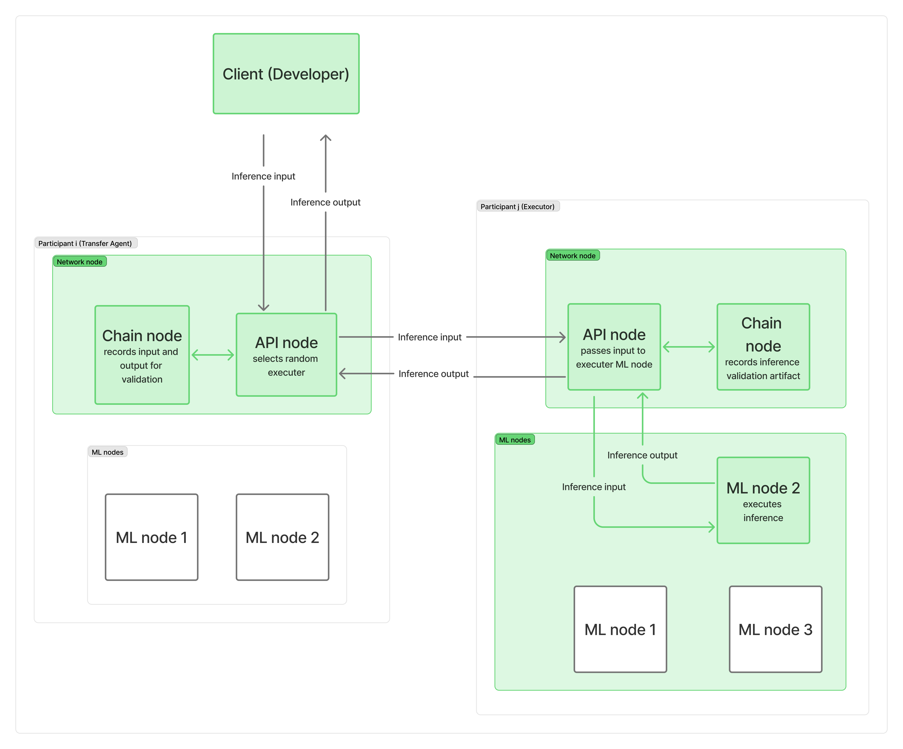

# TEE

This proposal outlines the integration of Trusted Execution Environments (TEE) into the Gonka network architecture. By leveraging hardware-level isolation (Intel TDX, AMD SEV-SNP, NVIDIA Confidential Compute), we can protect user payloads and inference data from the physical hosts/miners, enabling true "Confidential MLNodes." This document proposes changes to the node registry, validation pipeline, and economic incentives.

## Problem

Currently, user requests data sent to the Gonka network is hidden from the public but transparent to the specific host (miner) executing and validating the workload. Even with off-chain payloads, a malicious operator with physical access to the machine can access the data by using custom binaries or modifying the execution environment.

For enterprise and privacy-sensitive adoption, trust in the protocol must supersede trust in the hardware operator.

## Proposal

We propose a new node class: the Confidential MLNode. This node operates within a TEE, isolating the full Virtual Machine (VM) from the hypervisor.

Supported CPUs:

- Intel TDX: https://www.intel.com/content/www/us/en/developer/tools/trust-domain-extensions/overview.html
- AMD SEV-SNP: https://www.amd.com/en/developer/sev.html

Both technologies support attaching NVIDIA GPUs with Confidential Compute:
- https://docs.nvidia.com/nvidia-secure-ai-with-blackwell-and-hopper-gpus-whitepaper.pdf

A VM with an attached GPU can encrypt all in-memory data, data transferred to the GPU, and data in GPU memory from the hypervisor.

By carefully modifying how MLNode works with data:
- Inferences are decrypted only in-memory
- No sensitive data is written to disk
- No open TCP ports are used for unencrypted data transfer
- No sensitive data appears in logs

The full inference pipeline can be protected from both the host/miner and the hypervisor (server owner in the case of rented servers).

Using a temporary public key generated by the TEE-protected MLNode enables end-to-end data encryption without any decrypted data existing in unprotected memory.


## Architecture Upgrade

### MLNode

- VM with MLNode is launched from an image with metadata saved on-chain (model embedded). Full MLNode behavior is defined by its REST API
- VM generates a key pair for data encryption/decryption
- VM provides an attestation certificate signed by the CPU's hardware module. The signed data includes:
    - Hardware information
    - GPU information, including Confidential Compute enabled, exclusive access to GPU, and GPU attestation
    - Exact VM metadata
    - Public key from generated key pair
    - Proof that VM launched from correct entrypoint (target application)
    
    Note: If the VM is restarted or the image is replaced, the private key will be lost.
- Host publishes this certificate on-chain

**Open Question 1:** Should the certificate be validated on-chain?

All requests to the Confidential MLNode are encrypted using the public key from the certificate.

---
Relevant materials:

Framework to simplify TEE deployment:
- https://github.com/Dstack-TEE/dstack

Insightful paper about NVIDIA Confidential Compute:
- https://arxiv.org/pdf/2507.02770


### Network Node

#### 1. New MLNode Type

Confidential MLNode with a separate pipeline for scheduling inferences. These nodes do not require inference validation.

Confidential MLNodes have an associated attestation certificate and public key.

#### 2. Certificate Validation

Requirements for certificate validation:
- Publishing certificates to the blockchain
- Maintaining Intel and AMD root certificates (Root of Trust keys) for verification
- Maintaining a list of secure software versions and excluded (untrusted) certificates

**Open Question 2:** Should full certificate validation be performed on-chain? Probably yes, on recording.

#### 3. Inference Pipeline

Current `/chat/completions` request flow:

```
Dev -> Transfer Agent (Network Node) -> Executor (Network Node) -> Executor (MLNode)
```



https://what-is-gonka.hashnode.dev/decentralized-ai-inference-balancing-security-and-performance


In the current system, any request is scheduled to any executor. For Confidential MLNodes, the workflow changes:

- User obtains the Confidential MLNode's public key for encryption
- User encrypts the payload using the public key
- Encrypted request is sent to and decrypted on the specific Confidential MLNode

This design enables users to send `/chat/completions` requests directly to the Confidential MLNode without proxying through multiple Network Nodes.

##### Possible Pipeline & Payment

Proposed workflow:

1. User sends a request to any Network Node to reserve a Confidential MLNode with quota (possibly for a long-living session)
2. Chain randomly assigns a Confidential MLNode, moves quota from user's account to escrow, returns the Confidential MLNode's public key and certificate to the user
3. User encrypts payload and sends to MLNode:
   - Option 1: Directly to MLNode
   - Option 2: Through any Network Node in the network
4. Confidential MLNode performs computation and encrypts response with the user's public key
5. User decrypts response with their private key
6. Confidential MLNode signs response metadata (used tokens) and sends to its Network Node
7. Network Node submits signed metadata to claim coins from escrow. Confidential MLNode signature is verified on-chain before claim

Note: Metadata can be sent in batches periodically to optimize on-chain transactions. Unclaimed quota is automatically refunded at the next epoch boundary.

Signed metadata from a TEE key is inherently trusted - the execution environment is pre-defined and verified via attestation. The MLNode cannot produce valid signatures without running in the attested TEE, which guarantees the correct binary ran.

---

**Open Question 3:** How to provide redundancy when a Confidential MLNode becomes unavailable?


### Economic Incentive

- Confidential MLNode inferences do not need validation
    => eliminating the need to share work rewards with validators
    => eliminating need to generate and store artifacts for validation
- Confidential MLNodes do not need to participate in all PoC rounds if they maintain the same key pair, since this proves consistent hardware
- Confidential Inferences are priced in a separate dynamic pricing group per model, making these inferences more profitable when demand is high

**Open Question 4:** Since Confidential MLNodes have less validation overhead, should they receive higher bitcoin-style rewards to incentivize enabling TEE?
